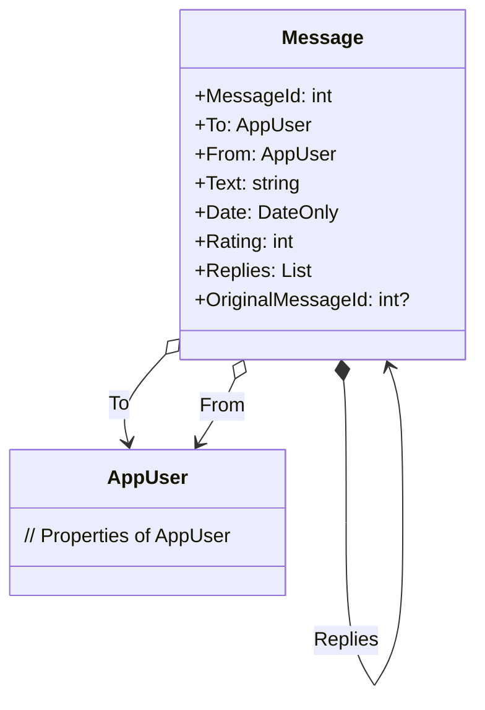

<h1>More on Designing a Domain Model</h1>

**CS296N Web Development 2**

| Weekly topics                             |                                               |
| ----------------------------------------- | --------------------------------------------- |
| 1. 1. Publishing a site to a Linux server | 6. Load testing and performance               |
| 2. Intro to Identity                      | 7. Complex domain models                      |
| 3. Authentication                         | 8. <mark>More on complex domain models</mark> |
| 4. Authorization                          | 9.  Validation                                |
| 5. Async/Await                            | 10. Term project / Docker containers          |

## Contents

[TOC]

## Intro

### Q & A

- Are there any questions about anything?

### Review

- Domain Driven Design

  - Aggregates
  - Root entities
  - Design decisions about relationships between domain model classes.

- Cascade delete&mdash;this is how we implement a composition relationship when using Entity Framework.
  - Add an FK (non-nullable) in the dependent model class to cause cascade delete.
    - Example: Review has a collection of comment objects, Comment has a FK for Review.

  - The default relationship is aggregation (no cascade delete). This is what you get if there is no FK in the dependent model class. 

- Multiple examples (see links below) of persistent domain models with both composition (cascade delete) and aggregation relationships:

  - 2022 BookReview example, branch 7-ComplexDomain, has 3 persistent model classes: `Review`, `Comment` and `AppUser` .
  - 2023 BookReview example ([previous notes](CS296N-LN-WK05-D1-ComplexDomain.html) show code from this) with 5 persistent model classes: `Book`, `Author`, `Review`, `Comment` and `AppUser`. Includes a many-to-many relationship between `Author` and `Book`.
  - 2024 AllAboutPigeons example with 2 persistent model classes: `Message`, with a self-referential composition relationship for replies, and `AppUser`.

## Self-Referential Composition Relationship

In the AllAboutPigeons example, `Message` objects can have replies which are also `Message` objects. Here's the UML class diagram:



Here's the code. Note that the `Foreignkey` attribute is on the `List<Message>` collection property. The FK property name is passed into the attribute constructor. This shows that the FK property is referencing the `List<Message>` collection.

```c#
public class Message
{
    [Key]
    public int MessageId { get; set; }
    public AppUser To {  get; set; }
    public AppUser From { get; set; }
    public string Text {  get; set; }
    public DateOnly Date {  get; set; }
    public int Rating { get; set; }
    
    [ForeignKey("OriginalMessageId")]
    public List<Message> Replies { get; set; } = new List<Message>();
    public int? OriginalMessageId { get; set; } = null;
}
```

It appears that neither MySQL nor SQL Server support cascade delete of self-referencing tables, so we have to implement that in the delete method of our repository:

```c#
 public int DeleteMessage(int messageId)
 {
     Message message = GetMessageByIdAsync(messageId).Result;
     // If the message has replies, remove them first to avoid a FK constraint violation
     if (message.Replies.Count > 0)
     {
         foreach (var reply in message.Replies)
         {
             _context.Messages.Remove(reply);
         }
     }
     _context.Messages.Remove(message);
     return _context.SaveChanges();
 }
```


## Examples

- 2022 example, using .NET 3.2, SQL Server, and 3 domain model classes:
    - [CS296N-Example-BookReviews](https://github.com/LCC-CIT/CS296N-Example-BookReviews/tree/7-ComplexDomain/BookReviews/BookReviews/Models), branch 7-ComplexDomain on GitHub.
    - [UML class diagram](https://github.com/LCC-CIT/CS296N-Example-BookReviews/blob/7-ComplexDomain/BookReviews/Docs/BookReviewsComplexDomainModel.pdf) of the domain model.

- 2023 example, using .NET 6.0, MySQL, and 5 domain model classes:
    -  [CS296N-Example-BookReviews-DotNet6](https://github.com/LCC-CIT/CS296N-Example-BookReviews/tree/7-ComplexDomain/BookReviews/BookReviews/Models), branch 07-ComplexDomain on GitHub.
    - [UML class diagram](https://github.com/LCC-CIT/CS296N-Example-BookReviews-DotNet6/blob/07-ComplexDomain/Docs/BookReviewsDomainModel.pdf) of the domain model.
- 2024 example using .NET 6.0, MySQL and a domain model with self-referential composition (Message class):
  - [CS296_AllAboutPigeons](https://github.com/ProfBird/CS296_AllAboutPigeons/tree/Lab06), Lab06 branch.


-----

 [](http://creativecommons.org/licenses/by/4.0/)ASP.NET Core MVC Lecture Notes by [Brian Bird](https://profbird.dev), written winter 2023, revised <time>2024</time>, are licensed under a [Creative Commons Attribution 4.0 International License](http://creativecommons.org/licenses/by/4.0/). 
