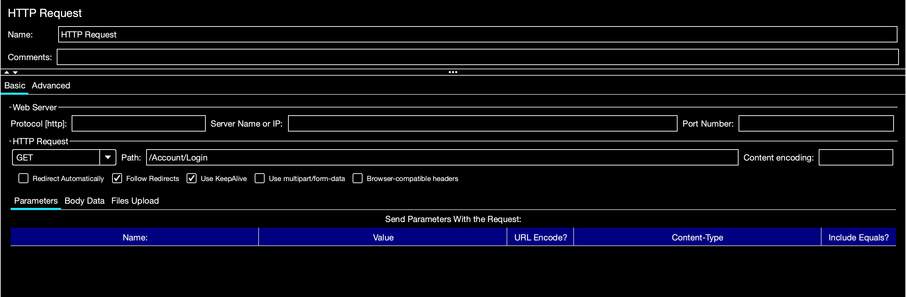

# *Load Testing* 

| Weekly topics                          |                                              |
| -------------------------------------- | -------------------------------------------- |
| 1. Publishing a site to a Linux server | <mark>6. Load testing and performance</mark> |
| 2. Intro to Identity                   | 7. Complex domain models                     |
| 3. Authentication                      | 8. Validation                                |
| 4. Authorization                       | 9. Docker containers                         |
| 5. Async/Await                         | 10. Term project                             |

## Contents

[TOC]

------

## Introduction

- Q and A


## How to Use JMeter

JMeter is a popular free, open source, tool for load testing web sites. You can use it to simulate any number of simultaneous visitors to your site and you can write (or record) a test script of actions that those simulated visitors will take on the site. These actions can include registering, logging in, making posts, etc.

Two of the primary metrics reported by JMeter are:

- **Latency**: The time elapsed from when the HTTP request was sent until an initial response was received. This is comparable to *First Contentful Paint* in Google Lighthouse.
- **Sample Time**: The time that the server took to fully serve the request (response + latency). This is comparable to *Time to Interactive* in Google Lighthouse.


### Downloading and Running JMeter

JMeter requires the Java Runtime Environment (JRE). You can check to see if Java is installed on your Windows computer by opening a command prompt and typing: `java -version`. For the current version of JMeter (as of August 2022), you need version 1.8 of Java (known as "Java 8") or higher. If Java is not on your computer, or you have an older version, you can download the latest version from the [official Oracle Java website](https://www.java.com/en/) and install it.

 Download JMeter from the [official Apache JMeter web site](https://jmeter.apache.org/). You can either download a "tarball" (.tgz) file or a Zip (.zip) file. Download whichever one you have the tools to unarchive (unzip). 

JMeter doesn't have an installation or setup program. You just run it from wherever you put the unarchived apache-jmeter-5.4.3 folder.  The program will run from almost anywhere you put the folder, but some features won't work on Windows if you put it in `C:\Program Files`&mdash;particularly, you won't be able to record test scripts because JMeter won't have permission to write a file in the Program Files folder.

On Windows, you run JMeter by double-clicking on `ApacheJMeter.bat`, which is in the bin folder. If you want to create a shortcut to the .bat file to more easily start JMeter, you can do that and place it on your desktop.

On a Mac, you can put the JMeter folder in the Applications folder. You start the app by double-clicking on `ApacheJMeter.jar`.


### Setting up a Test Plan Manually

Follow the instructions in the tutorial by Anicas (2014),  [How To Use Apache JMeter To Perform Load Testing on a Web Server](https://www.digitalocean.com/community/tutorials/how-to-use-apache-jmeter-to-perform-load-testing-on-a-web-server). 

#### Notes on Settings

##### Thread Group

- **Number of Threads (users)**

  A practical maximum number of threads that can be handled by an average host desktop machine running JMeter would be around 500 (depending on the test plan and loop count). 

  Note that each thread will execute the test plan's HTTP requests <u>once</u> and then terminate, unless the loop count is greater than 1. The threads will <u>not necessarily execute simultaneously</u>.

- **Ramp-up period (seconds)**

  This specifies how long JMeter will take to start all the threads. If the number of threads is 100 and ramp-up period is 10 seconds, then JMeter will start 10 new threads per second. 

  Once ramp-up period has completed, all the threads will have been started and the test will run for as long as it takes for each thread to execute all the HTTP requests in the test plan.

- **Loop Count**

  This determines the number of times each thread will execute the test plan. If it is set to 1, each thread will terminate as soon as it has completed the HTTP requests in the test plan. 

  Note that if you want all the threads to run concurrently, you will need to set the loop count to some number greater than 1. For example, a test plan with just 2 HTTP requests and 50 threads might need a loop count of around 200 in order for all the threads to run simultaneously for at least part of the test. The loop count required for all threads to be running concurrently depends on the number of HTTP requests and the sample time.

##### HTTP Request Defaults

- **Server Name or IP**

  Do not include https:// or http:// in the server name. If you wish to specify https do it in the *protocol* field.
  
  

### Recording a Test Plan

Follow the instructions in the tutorial by Anicas (2014), [How to Use JMeter to Record Test Scenarios](https://www.digitalocean.com/community/tutorials/how-to-use-jmeter-to-record-test-scenarios). 

#### Notes on the tutorial

- Test Script Recorder

  Add the *HTTP(S) Test Script Recorder* to the *Test Plan*, not the *Workbench*. The Workbench is no longer a part of JMeter. 

- 
  Port Setting

  The default port for the proxy is now 8888.

- HTTPS
  The instructions say to check “Use this proxy server for all protocols”. This setting no longer exists and is not needed. We will not use HTTPS between the browser and JMeter.

- Firefox proxy settings (for Firefox for Windows)

  - Located under *Network Settings* (at the bottom or general settings)


#### Configuring Firefox to Use a Proxy on Mac OS

If you are running JMeter on Mac OS, you will need to:

- Check the box labeled **Also use this proxy for HTTPS** in the proxy settings dialog shown above. 
- Import a security cerfificate generated by JMeter. You do this in the Firefox settings by going to *Privacy and Security*, Security, *Certificates*, 
  - Click the button labeled **View Certificates**
  - Click the button labeled **Import...**
  - In the file chooser that pops up, navigate to the `JMeter/bin` folder and select the `ApacheJMeterTemporaryRootCA.crt` certificate file.


### Managing Anti-forgery Tokens

ASP.NET automatically [injects anti-forgery tokens](https://docs.microsoft.com/en-us/aspnet/core/security/anti-request-forgery?view=aspnetcore-3.1#aspnet-core-antiforgery-configuration) into HTML form elements in views. You can see this if you run go to the loging page of a running web app and view the page source. It will look something like this:

```html
<input name="__RequestVerificationToken" type="hidden" value="CfDJ8H78Yg0pQSdFvzSWY33NhOQWK7KCFFm27e8Qst1L4Gp4OouVs2NLE77D_wM-xqwxOlzICeBn2dKjqQ2Ct60Nt6_Tpgifdy6ksNxpWlzx7V15SUZzSN_0ESFBGnZp0oNA1NZq9G283-ECbQrmpsz89qo" />
```

If you don't configure your JMeter test to manage anti-forgery tokens, when you try to authenticate a user, you will get a error response like this:

> The anti-forgery cookie token and form field token do not match.

This article explains how to resolve this issue: [Handling ASP.NET MVC's Anti-Forgery Tokens when load testing with Meter](https://buildmeasurelearn.wordpress.com/2016/11/23/handling-asp-net-mvcs-anti-forgery-tokens-when-load-testing-with-jmeter/).

These are the steps for adding the items to our test plan that we need in order to manage anti-forgery tokens:

1. Add a Cookie Manager, if there isn't already one in the test plan.

2. Add an HTTP GET request to get the login page.

   - Right-click on *Thread Group*, *Add*, *Sampler* and select *HTTP Request*.
   - Set the HTTP Request type to GET.
   - Set the path to the controller/method of your login page, such as `Account/Login`

   

3. Add a Regular Expression Extractor  
   We need to load the request varification token that is in the hidden input field into a JMeter variable so we can use it when we make a post request. We will use a [regular expression](https://learn.microsoft.com/en-us/dotnet/standard/base-types/regular-expression-language-quick-reference) so that we get just the *value* out of that input field.

   - Right-click on *HTTP Request*, *Add*, *Post Processors* and select *Regular Expression Extractor*.

   - Enter values in the following fields:

     - Name of created variable: requestVerificationToken
     - Regular Expression: `name="__RequestVerificationToken" type="hidden" value="([A-Za-z0-9+=/\-\_]+?)"`
     - Template: `$1$`

     

4. Add a HTTP POST request to login to the site.  
   We will use the anti-forger token we retrieved from the login page to log JMeter in as a user.

   - Right-click on *Thread Group*, *Add*, *Sampler* and select *HTTP Request*.

   - Add the folling parameters to send with the POST request:  
     (These parameters shoud match the input field names on your login page.)

     | Name                       | Value                       | URL Encode | Type | Include Equals |
     | -------------------------- | --------------------------- | :--------: | ---- | :------------: |
     | Username                   | BrianBird                   |    [  ]    |      |      [X]       |
     | Password                   | Secret!123                  |    [  ]    |      |      [X]       |
     | __RequestVerificationToken | ${requestVerificationToken} |    [X]     |      |      [X]       |

     

### Adding Additional Listeners

In addition to the  "View Results in Table" listener described in the tutorial by Ancias (2014), you may want to add some others. Here are some useful ones:

#### View Results Tree

This listener will let you see detailed results for each HTTP response. If you are getting error responses this is especially useful in helping you determine the cause of the errors. Here are some examples:

- This is the type of error you might get when the web server is getting too many simultaneous requests to handle:

  > Response code: 503
  > Response message: Service Unavailable

- This error message indicates that you are trying to send requests at a rate the computer running JMeter can't handle:

  > Response code: Non HTTP response code: java.net.SocketException
  > Response message:Non HTTP response message: Socket closed

#### Graph Results

This listener shows you graphs of web stite performance over time as more simulated users are added to the test.

#### Summary Report

This listener gives you a statistical summary of the parameters measured in your test.


### Running a Test from the Command Line

To get better test results you should run the test from the command line. When you run the test from the GUI, the overhead of the GUI limits JMeter's ability to deliver simulated users (threads) at a high rate.

The JMeter documentation provides a list of [options for running from the command line](https://jmeter.apache.org/usermanual/get-started.html#non_gui). If you want to run a test that you have set up and saved using the GUI, you use a command with this syntax:

`jmeter -n -t [jmx file] -l [results file] -e -o [Path to web report folder]`

Example (run from the folder containing the .jmx file): 
`C:\apache-jmeter\bin\jmeter -n -t BookSite.jmx -l TestOutput.txt -e -o Dashboard`

**-n** specifies that JMeter run in CLI mode.

**-t** is followed by the path/filename of the test plan.

**-l** is followed by the path/filename for the file to which the test results will be saved.

**-e** causes a web page report dashboard to be generated after the test.

**-o** is followed by the path to the folder where the report dashboard files will be written.


#### Results of a Command Line Test

While the test is running, summary results like the ones below will be shown in the console (not a complete listing).

```
summary + 3516 in 00:00:20 = 171.9/s Avg:120 Min:45 Max:11629 Err:0 (0.00%) Active:41 Started:41 Finished:0
summary + 18732 in 00:00:30 = 624.5/s Avg:113 Min:46 Max:481 Err:0 (0.00%) Active:101 Started:101 Finished:0
summary = 22248 in 00:00:50 = 441.0/s Avg:114 Min:45 Max:11629 Err:0 (0.00%)
summary + 21970 in 00:00:30 = 732.3/s Avg:178 Min:74 Max:650 Err:0 (0.00%) Active:161 Started:161 Finished:0
summary =  44218 in 00:01:20 =  549.6/s Avg:146 Min:45 Max:11629 Err:0 (0.00%)
```

- **summary +** lines show incremental updates on the test.
- **summary =** lines show cumulative updates on the test.
- **3516** (just one example) is the number of HTTP requests sent, followed by the time period and the rate of requests.
- **Avg**, **Min**, and **Max** are sample times.
- **Err** is the number and percentage of HTTP error responses.
- **Active** is the number of concurrent threads, **Started** is the number of threads started during the time period of the summary, and **Finished** is the number of threads that terminated.

The results of the test will be put into the *ReportDashboard* directory. This forms a local web site that you can view by opening [index.html](../Labs/Lab06-LoadTesting/JMeter/ReportDashboard/index.html).


## Examples

- Example test file: [BookReviews-Book-1000.jmx](JMeterTestExample.html)
- The [Report Dashboard](../Labs/Lab06-LoadTesting/JMeter/ReportDashboard/index.html) in a static web site created by running a command-line test.


## References

- [JMeter Web Site](http://jmeter.apache.org/usermanual/generating-dashboard.html)&mdash;Official site: downloads and documentation.

- [Load Testing with Apache JMeter](https://www.digitalocean.com/community/tutorial_series/load-testing-with-apache-jmeter)&mdash;DigitalOcean tutorial by Mitchell Anicas, 2014.

- [JMeter Beginner Tutorials](https://www.youtube.com/playlist?list=PLhW3qG5bs-L-zox1h3eIL7CZh5zJmci4c)&mdash;YouTube

- [The Advanced Guide to JMeter Load Testing](https://www.blazemeter.com/blog/jmeter-load-testing)&mdash;BlazeMeter tutorial by Noga Cohen, 2020.

- [ASP.NET Login Testing with JMeter](https://www.blazemeter.com/blog/aspnet-login-testing-jmeter)&mdash;BlazeMeter tutorial by Dmitri Tikhanski, 2014.


[ ](http://creativecommons.org/licenses/by-sa/4.0/)
ASP.NET Core MVC Lecture Notes written by [Brian Bird](https://profbird.dev) in 2018, revised in <time>2023</time>, are licensed under a [Creative Commons Attribution-ShareAlike 4.0 International License](http://creativecommons.org/licenses/by-sa/4.0/). 
