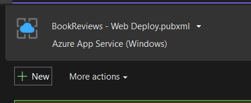

# Docker: Containerizing your Web App

**CS296N Web  Development 2: ASP.NET**

| Weekly topics                              |                                 |
| ------------------------------------------ | ------------------------------- |
| 1. Intro to course and Input validation    | 6. Async/Await                  |
| 2. Repositories and Unit Testing           | 7. Performance and Load Testing |
| 3. Publishing to Azure / Intro to Identity | 8. Complex Domain Models        |
| 4. Authentication                          | **9. Docker containers**        |
| 5. Authorization                           | 10. Term project                |

[TOC]

## Announcements and Questions

- Reading and Quiz
- Term Project&mdash;how is it going?
- Q and A


## Introduction

This is part 1 of a 2 part series on using Docker with ASP.NET Core. You will learn how to put your web app in a Docker Linux container and run it in the container on your development machine. In part 2, you will learn to publish your docker image to a repository (Azure Container Repository) and run the image on an Azure App Service with Linux as its operating system.

### Containers

From the [Docker web site](https://www.docker.com/resources/what-container):

> A container is a standard unit of software that packages up code and all its dependencies so the application runs quickly and reliably from one computing environment to another. A Docker container image is a lightweight, standalone, executable package of software that includes everything needed to run an application: code, runtime, system tools, system libraries and settings.

 Containers solve the "but it worked on my machine" problem. 

### Docker Containers

> Docker is an open platform for developing, shipping, and running applications. Docker enables you to separate your applications from your infrastructure so you can deliver software quickly. With Docker, you can manage your infrastructure in the same ways you manage your applications. By taking advantage of Docker’s methodologies for shipping, testing, and deploying code quickly, you can significantly reduce the delay between writing code and running it in production.

## Setting up Docker

Follow the instructions on the [Get Docker](https://docs.docker.com/get-docker/) page. Docker can be installed on Windows, Mac OS, or Linux.

**Notes:**

- On Windows, the Docker Desktop app relies on WSL 2, ([Windows Subsystem for Linux](https://docs.microsoft.com/en-us/windows/wsl/about)). During the Docker installation you will be prompted to set up WSL 2, if you have not already installed it.
- If you run the 2 minute Getting Started tutorial that is launched by the installer, at the last step, after you run your container, you will need to open a browser to the address http://localhost, or, in Docker Desktop, click on "Open in browser" to see the web page that's being hosted in the container.
  - The container you created in this tutorial is a Linux container. To see the version of the Linux kernel the container is running on, type: `uname -r`. To see which Linux distribution is running in the container type: `cat /etc/issue`.

------

## Running a Web App in a Container

We will wet up a framework-dependent ASP.NET Core web app to run in a Linux  Docker container.

#### Modify your web app to use SQLite

When I started writing these notes, I tried to set up my web app to use Azure SQL Server as the database, but got errors trying from the SQL Server provider when I tried to run my app on Linux. For this reason, I switched to SQLite.

1. Install NuGet package: Microsoft.EntityFrameworkCore.Sqlite

2. Change the ConfigureServices method of Startup:

   ```c#
   services.AddDbContext<BookReviewContext>(
     options => options
       .UseSqlite(Configuration["ConnectionStrings:SQLiteConnection"]));
   ```

3. Add a connection string to appsettings.json
   ```json
     "ConnectionStrings": {
        "SQLiteConnection": "Data Source=Data/BookReviews.db" }
   ```

4. Remove any old migrations and add a new migration.

5. Update the database.

#### Publish your web app to a folder

1. Make a new publish profile and use it to  publish your web app to a folder on your development machine. 

   - Open a new profile.
     

   - Select "Folder" as the destination for publishing your web app. You can use the default path, `bin\Release\netcoreapp3.1\publish\`, or change it if you wish.
     

   - Edit your new profile.
      

   - Use all the setting you used in the previous one, including your Azure database connection string. but change the "target runtime" to "linux-x64".
      

   - Publish the web app.

#### Create a Docker image and run it in a Linux container

1. Create a file named *Dockerfile* in your web app solution folder (the same folder as your .sln file).  This file will contain the instructions to build an image for your container. 
   Example: 

   ```dockerfile
   # download the ASP.NET Core runtime
   FROM mcr.microsoft.com/dotnet/core/aspnet:3.1
   ```

   - FROM—downloads an image of the .NET Core runtime from the Microsoft Docker image repository. This will be the the first layer of your web app image and the base for the rest of the instructions.

2. Build the image and give it a name, following the `-t`. (The tag is optional and could be given in the `name:tag` format.) The dot means that the Dockerfile is in the current folder. Execute this command in the folder containing the Dockerfile: 

   ```bash
   docker build -t yourwebappname . 
   ```

   - You should now see the image listed in Docker Desktop[^1]

   - To test the image, you can run it from Docker Desktop by clicking on an image's Run button. This will automatically create a container and run it. You can then click on the container's CLI button to open the CLI. check the version of .NET Core that is installed:
     `dotnet --info`

     Note that this is a Linux[^2] container. You just ran a command for the .NET Core runtime in Linux!

     Delete the container since we are going to add more layers to the image and will need to re-create the container[^3].

3. Add more commands to the Dockerfile that will add the image layers for your web app. The new commands will:

   - Copy the web app's binaries into the image.
   - Set a working directory for the web app.
   - Set the HTTP ports to listen on.
     *Note: I currently haven't been able to get HTTPS on port 443 to work.*
   - Set the run-time commands that will start the web app.

   ```dockerfile
   # Copy files from the dev machine to the container.
   COPY BookReviews/bin/Release/netcoreapp3.1/publish/ app/
   # Set a new working directory. The web app will run from this directory.
   WORKDIR app/
   # Ports for the app to listen in inside the container (http and https)
   EXPOSE 80
   EXPOSE 443
   # Start the web app when the container runs.
   ENTRYPOINT ["dotnet", "BookReviews.dll"]
   ```

   - COPY—copies files from the source path: *BookReviews/bin/Release/netcoreapp3.1/publish/*, and adds them to the destination container filesystem at: *app/*
   - WORKDIR&mdash;sets the working directory for any subsequent RUN, CMD, ENTRYPOINT, COPY and ADD instructions.
   - EXPOSE&mdash;Opens up network ports in the Docker container to the host operating system.
   - ENTRYPOINT—specifies the command to run when the container starts. The first item in the square brackets is the command, the ones that follow it are arguments for that command.

4. Build your image again as you did in step 2.

5. Run the the container[^4]
   `docker run --rmd -p 5000:80 bookreviews`

   The -p switch maps port <u>80 inside</u> the container to <u>5000 outside</u> the container[^5].
   
6. Upload the image to Docker Hub or any other container registry. 


## Troubleshooting

### Did the App Start in the Container?

If the app started correctly when you started it (step 5 above), then you should have seen a response like this in the terminal:

```bash
info: Microsoft.Hosting.Lifetime[0]
      Now listening on: http://[::]:80
info: Microsoft.Hosting.Lifetime[0]
      Application started. Press Ctrl+C to shut down.
info: Microsoft.Hosting.Lifetime[0]
      Hosting environment: Production
info: Microsoft.Hosting.Lifetime[0]
      Content root path: /app
```

### Does it Run Correctly Elsewhere?

If your app working in the Docker container, then verify where it does work.

- Does it work when you run it from Visual Studio?
- Does it work when you run it from the publish directory using the WSL command line: `dotnet yourwebapp.dll`?

Open a command line interface on the container:
`docker exec container_name -it bash`

### View Web App Logs

This Docker command will show all your web app's messages since the container was started:

`docker logs container_name`


## References

- [Getting Started with Docker](https://addons.mozilla.org/en-US/firefox/addon/jetbrains-toolbox/)
- Addie, S. & Anderson, R. (2022). [Host ASP.NET Core in Docker Containers](https://docs.microsoft.com/en-us/aspnet/core/host-and-deploy/docker/?view=aspnetcore-3.1). ASP.NET Core 3.1 Documentation, Microsoft. 
- De George, Andy, et al. 2021. [ How to containerize a .NET Core  application](https://docs.microsoft.com/en-us/dotnet/core/docker/docker-basics-dotnet-core). .NET Core Guide, Microsoft 
- Staff. 2019. [Get Started with Docker](https://docs.docker.com/get-started/). Docker. 
- Staff. 2019. [Dockerize  a .NET Core Application](https://docs.docker.com/engine/examples/dotnetcore/). Sample Applications,Docker. 
- [ASP.NET Core Runtime Images](https://hub.docker.com/_/microsoft-dotnet-aspnet/) on DockerHub.

---------------


 [ ](http://creativecommons.org/licenses/by-sa/4.0/) ASP.NET Core MVC Lecture Notes, licensed under a [Creative Commons Attribution-ShareAlike 4.0 International License](http://creativecommons.org/licenses/by-sa/4.0/), by [ Brian Bird](https://profbird.dev), winter 2019, updated winter <time>2022</time>.

[^1]: You can also use the CLI command `docker images` to see the images currently installed. 
[^2]: Use this command to check the Linux distribution and version: ` cat /etc/issue.net`
[^3]: You can delete the container using Docker Desktop, or from the command line. The CLI command `docker ps -a` will show you all the containers. The command `docker rm continer_name`.
[^4]: Alternatively, you can create a container before running it: `docker create bookreviews`, then start the container using it's auto-generated name: `docker start amazing_germain`. You can stop it using: `docker stop amazing_germain`.

[^5]: If you are specifying a port in appsettings.json, be sure you don't specify localhost. Use + to represent a wild-card domain, like this:  "http://+:5001"

