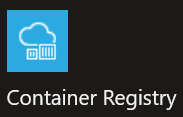
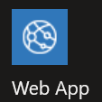

# Docker: Containerizing your Web App

**CS296N Web  Development 2: ASP.NET**

| Weekly topics                              |                                 |
| ------------------------------------------ | ------------------------------- |
| 1. Intro to course and Input validation    | 6. Async/Await                  |
| 2. Repositories and Unit Testing           | 7. Performance and Load Testing |
| 3. Publishing to Azure / Intro to Identity | 8. Complex Domain Models        |
| 4. Authentication                          | **9. Docker containers**        |
| 5. Authorization                           | 10. Term project                |

[TOC]

## Announcements and Questions

- Next week's agenda&mdash;it's the last week of class.
- Q and A

## Introduction

This is part 2 of a 2 part series on using Docker with ASP.NET Core.  you will learn to publish your docker image to a repository (Azure Container Repository) and run the image on an Azure App Service with Linux as its operating system.

### Azure Container Registry

You can push your Docker image to Docker Hub or any other container registry such as the Azure Container Registry (ACR). I'm using ACR in this example.

> Azure Container Registry (ACR) is a managed, private Docker registry service based on the open-source Docker Registry 2.0. Create and maintain Azure container registries to store and manage your private Docker container images and related artifacts.
&mdash;[Introduction to private Docker container registries in Azure](https://docs.microsoft.com/en-us/azure/container-registry/container-registry-intro)

Note that a container registry is a place to store <u>images</u>, not containers.

#### Create an ACR Service

1. Log into the [Azure portal](https://portal.azure.com).
2. Click the "+ Create" button, then type "container registry" in the search box.
3. Click on   then click on the "Create" button.
4. Enter all the required information
   - **Subscription**: Azure for Students subscription.
   - **Resource Group**: Any existing resource group. (For good organization choose the same one you will use for the App Services that will host your containers.)
   - **Name**: Make up one that is descriptive.
   - **Location**: Choose any region. (For good organization use the same one as the resource group.)
   - **SKU**: Standard&mdash;this is the free one.
5. After your container registry has been created, open it and click on "Access keys". Set "Admin User" to "Enabled".

#### Push a Docker Image to ACR

1. Before pushing the image of your containerized web app to your repository, you need to tag with the repository name and some version number you make up. 
   Use this command:
   `docker tag {imagename} {acrname}.azurecr.io/{imagename}:v1 `
   Where {imagename} is the name of your image and {acrname} is the name of your ACR service.

   Here is an example using my BookReviews web app image and my ACR service:
   `docker tag bookreviews bookreviews2022.azurecr.io/bookreviews:v1`
   
2. You can view your image to see the tag:
   `docker image ls`

3. Log into your ACR service. 
   (To do this step, you need to [install the Azure CLI](https://docs.microsoft.com/en-us/cli/azure/install-azure-cli))
   `az acr login --name {your ACR name} `

   You will be asked for login credentials. You get these from the Azure portal, in the "Access Keys" page of your ACR service.

   - Username: this is your user name as shown on the "Access Keys" page.
   - Password: this is a GUID that you can copy from the "Access Keys" page.

   Here's an example for my ACR service:
   ```powershell
   PS C:\Users\Brian> az acr login --name bookreviews2022
   Unable to get AAD authorization tokens with message: Please run 'az login' to setup account.
   Unable to get admin user credentials with message: Please run 'az login' to setup account.
   Username: BookReviews2022
   Password:
   Login Succeeded
   ```

4. Now you can push the image to ACR using this command:
   `docker push {acrname}.azurecr.io/{imagename}`

   Here's an example using my BookReviews image:
   `docker push bookreviews2022.azurecr.io/bookreviews:v1`

5. In the Azure portal, open your ACR and click on "Repositories". You should see your image listed.

### Create an Azure App Service

1. Log into the [Azure portal](https://portal.azure.com).
2. Click the "+ Create" button, then type "web app" in the search box.
3. Click on   then click on the "Create" button.
4. Enter all the required information
   - **Subscription**: Azure for Students subscription.
   - **Resource Group**: Any existing resource group. (For good organization choose the same one you will use for the App Services that will host your containers.)
   - **Name**: Make up one that is descriptive.
   - **Publish**: Docker Container.
   - **Operating System**: Linux.
   - **Region**: Choose any region. (For good organization use the same one as the ACR.)
   - **App Service Plan**: Choose an existing plan or create a new one that uses the "Free F1" SKU.

### Deploy and Run the Containerized Web App

1. Log into the [Azure portal](https://portal.azure.com).
2. Open the App Service you just created and click on "Deployment Center".
3. Choose these settings:
   - **Source**: Container Registry
   - **Container Type**: Single Container
   - **Registry Source:** Azure Container Registry
   - **Subscription ID**: Azure for Students
   - **Authentication**: Admin Credentials
   - **Registry**: {Your ACR name}
   - **Image**: {Your image name}
   - **Tag**: v1
   - **Startup File**: leave empty
   - **Continuous deployment**: off
4. Click "save"
5. Click on "overview", then click on the URL for your web app.

## Troubleshooting

### Look at Logs

#### Deployment Center Logs

In the App Service, under "Deployment Center", click on the "Logs" tab to see logs from the docker engine.

#### Docker Container (Web App) Logs

First, enable logging by going to "App Service Logs" and setting "Application logging" to "File System". Save the changes.

There are two ways to look at the logs:

1. View the log stream: go to "Log Stream" and see the log messages coming from your web app in real time.
2. Use Kudu: Go to "Advanced Tools", click on "Go".


## References

---------------

[Install Azure CLI on Windows](https://docs.microsoft.com/en-us/cli/azure/install-azure-cli-windows?tabs=azure-cli)

[Run a custom container in Azure](https://docs.microsoft.com/en-us/azure/app-service/quickstart-custom-container?pivots=container-linux&tabs=dotnet) Note: this tutorial uses Visual Studio Code, but you can do all the same things from a command line.

[Enable diagnostics logging for apps in Azure App Service](https://docs.microsoft.com/en-us/azure/app-service/troubleshoot-diagnostic-logs)


 [ ](http://creativecommons.org/licenses/by-sa/4.0/) ASP.NET Core MVC Lecture Notes, licensed under a [Creative Commons Attribution-ShareAlike 4.0 International License](http://creativecommons.org/licenses/by-sa/4.0/), by [ Brian Bird](https://profbird.dev), winter 2019, updated winter <time>2022</time>.


